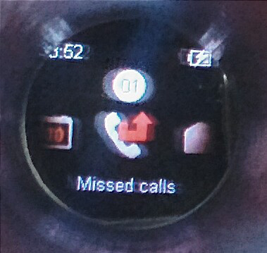
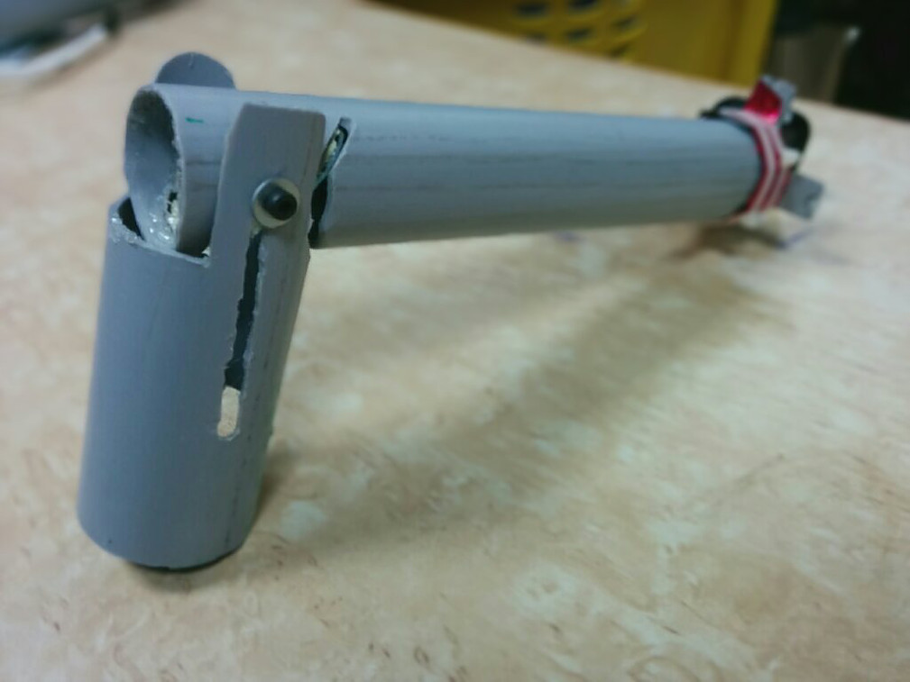
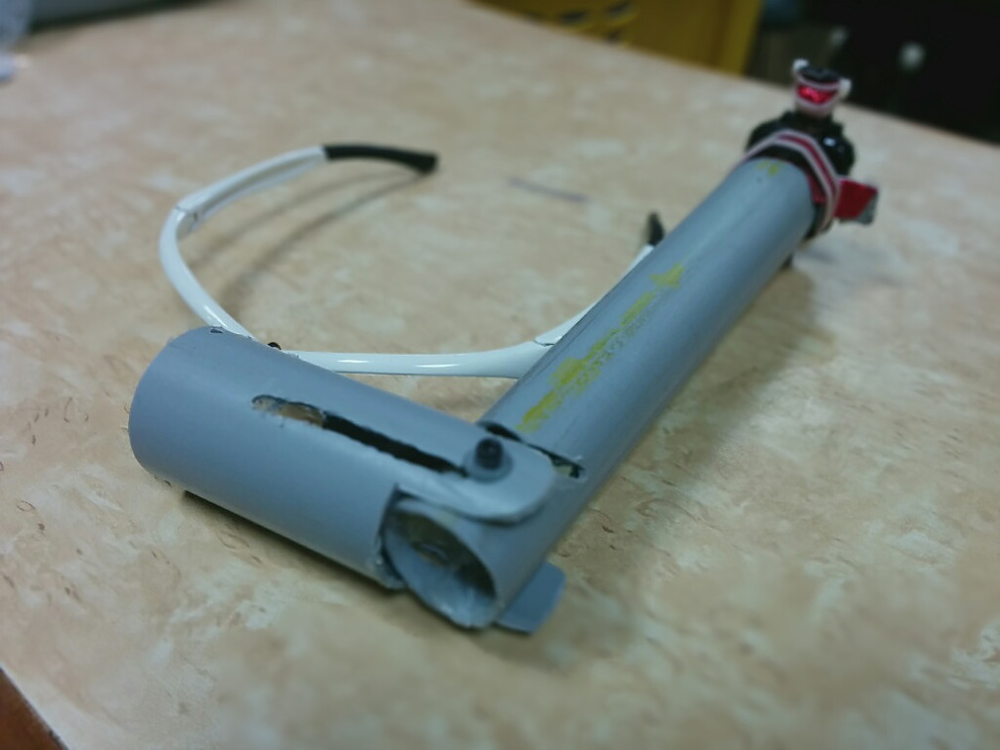
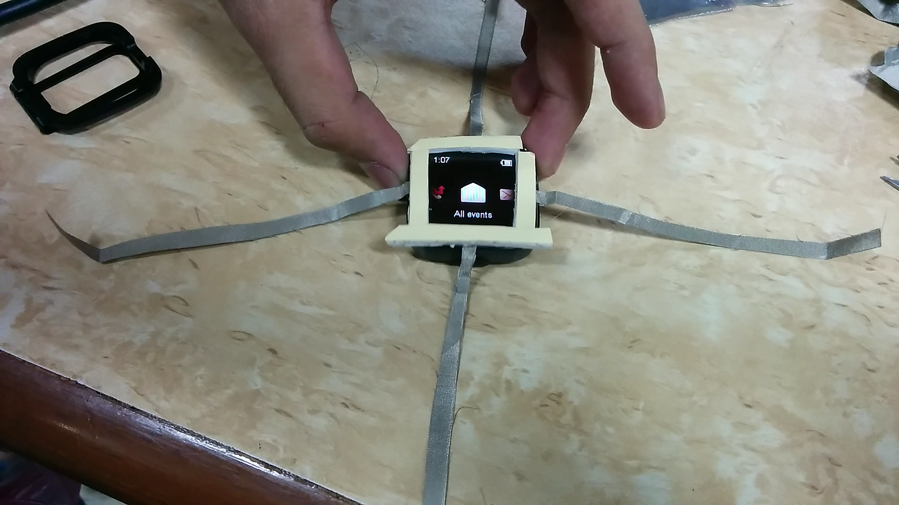
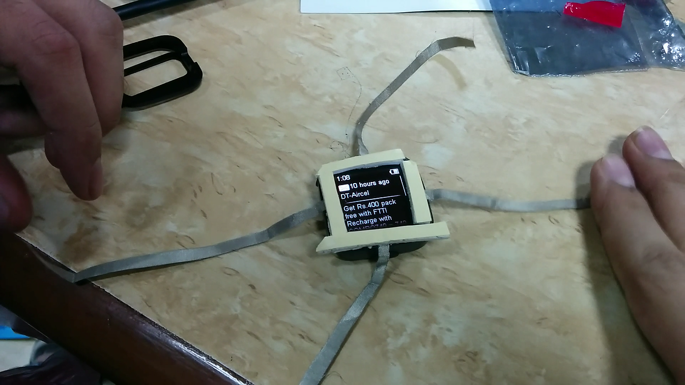
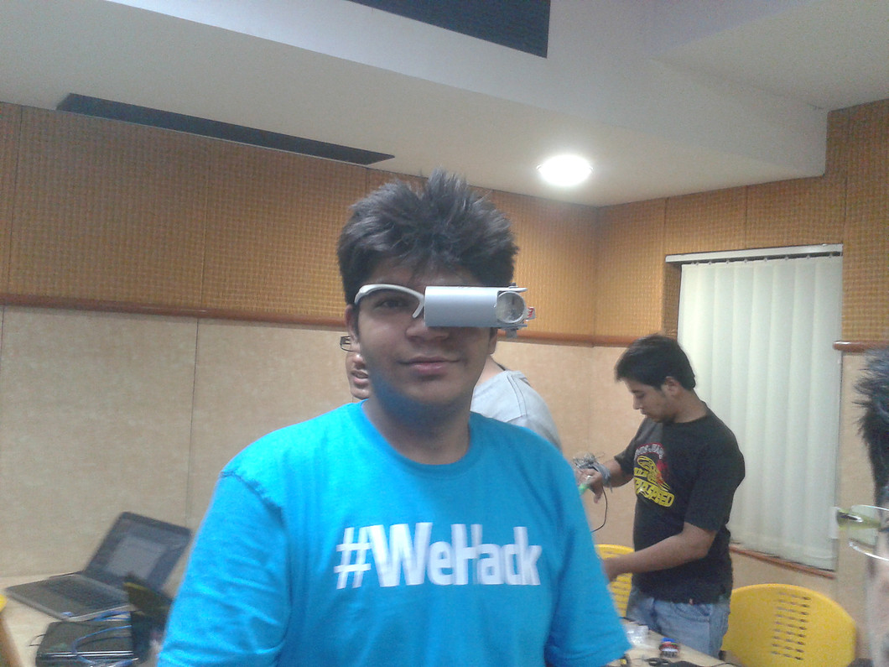
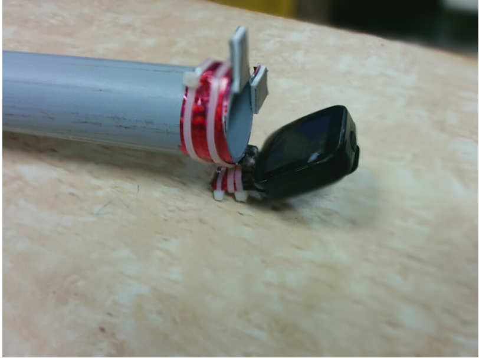
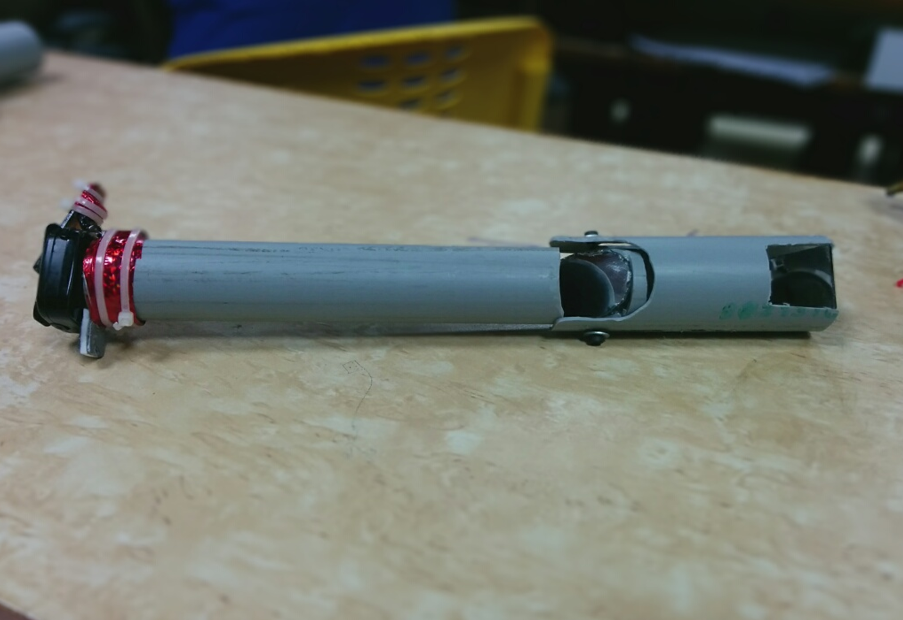
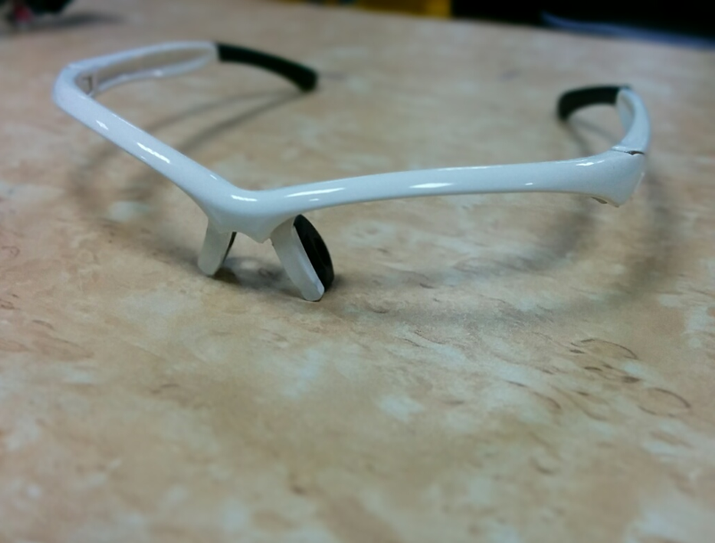

# Notifier-N-Connectifier
## A cost effective Google Glass alternative.

* Used the center piece of a Sony smart watch, basic principles of reflection and refraction. The 
* The watch can be paired with any bluetooth enabled smart phone.

   
   ```Actual view from the display```


* The frame was made using PVC pipes connected on top of a traditional spectacle frame.

 
	​```PVC pipe structure```


	​```PVC pipes mounted on a spectacle frame```


* Capacitive buttons on the the smart watch were extended using conductive fiber to give the user easy control.

 
	​```Extended the capacitve buttons```

 
	​```Conductive fiber was used to extend the buttons of the watch```

* The project was created in under 24 hours at a college hackathon.
* The finished prototype ( in the picture: Swayam Tibrewal , teammate for the hackathon)


	​```Finished prototype```

## Possible enchancements
* Replace opaque pipes with transparent , to not impair visibility.
* Add better functionality and control


### More pictures




